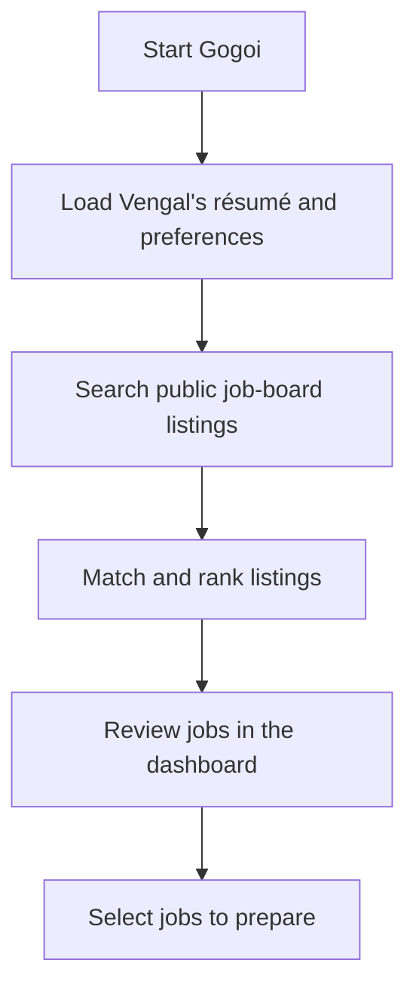
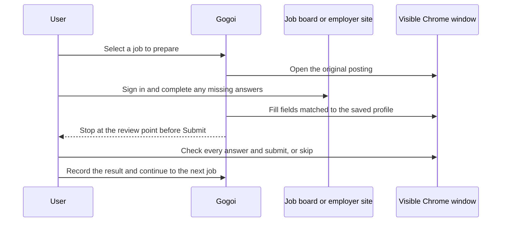

# Gogoi workflow

## Find and review jobs

```mermaid
flowchart TD
    A[Start Gogoi] --> B[Load Vengal's résumé and preferences]
    B --> C[Search public job-board listings]
    C --> D[Match and rank listings]
    D --> E[Review jobs in the dashboard]
    E --> F[Select jobs to prepare]
```

## Prepare one application at a time

```mermaid
sequenceDiagram
    participant User
    participant Gogoi
    participant Board as Job board or employer site
    participant Browser as Visible Chrome window
    User->>Gogoi: Select a job to prepare
    Gogoi->>Browser: Open the original posting
    User->>Board: Sign in and complete any missing answers
    Gogoi->>Browser: Fill fields matched to the saved profile
    Gogoi-->>User: Stop at the review point before Submit
    User->>Browser: Check every answer and submit, or skip
    User->>Gogoi: Record the result and continue to the next job
```

Gogoi does not click Submit. The user reviews and submits each application manually.
